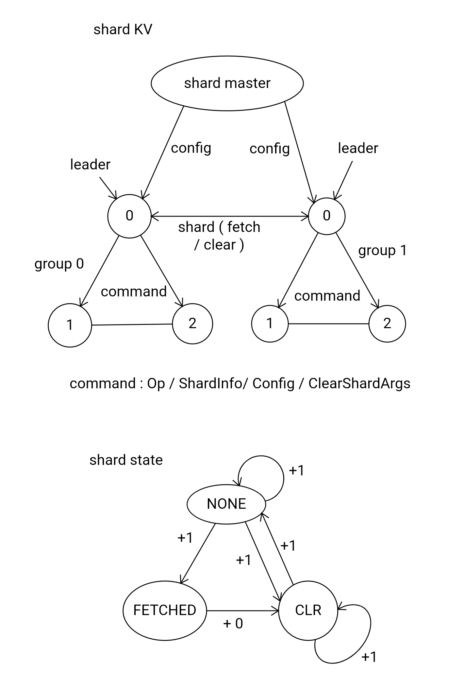

# Overview

This lab is from MIT 6.824 Spring 2020

Course link: http://nil.csail.mit.edu/6.824/2020/schedule.html

Lab 2 Psueudo Code: https://gist.github.com/jonhoo/ae65c28575b05da1b58e

# Lab 1: MapReduce

## Methdology

### RPC

```go
// N: task number
// S: file name (if has)
// Stage: MAP or REDUCE OR DONE
type RPCArgs struct {
	N int
	S string
	Stage int
}

// N: task number
// S: not used
// Stage: MAP or REDUCE OR DONE
// NReduce: number of reduce partitions
type RPCReply struct {
	N int
	S string
	Stage int
	NReduce int
}
```

RPC arguments and replies are shown as above. 

### Master

```go
func (m *Master) FetchTask(args *RPCArgs, reply *RPCReply) error { /* ... */ }
func (m *Master) FinishTask(args *RPCArgs, reply *RPCReply) error { /* ... */ }
```

Master provide two functions for worker to call.

The first one is FetchTask which worker could uses to get a task to work on.

The second one is FinishTask which worker could uses to report the task it has finished.

### Worker

```go
for {
  args := RPCArgs{}
  reply := RPCReply{}
  workerFetchTask(&args, &reply)
  w.nReduce = reply.NReduce
  workerProcessTask(&args, &reply, &w)
  args.N = reply.N
  args.Stage = reply.Stage
  workerFinishTask(&args, &reply)
}
```

Worker repeat the for loop above to fetch, process and finish tasks. Once master has exited workers would failed to do RPC calls and automatically exit.

## Key points

Master maintain a map which keeps the pending tasks and their counters in the current stage. It would assign the task with the least count to a worker. And the same task could be fetched and processed by multiple workers simultaneously but would be committed only once.

## Results

```
*** Starting wc test.
2020/03/01 14:00:30 rpc.Register: method "Done" has 1 input parameters; needs exactly three
2020/03/01 14:00:34 dialing:dial unix /var/tmp/824-mr-501: connect: connection refused
2020/03/01 14:00:34 dialing:dial unix /var/tmp/824-mr-501: connect: connection refused
2020/03/01 14:00:34 dialing:dial unix /var/tmp/824-mr-501: connect: connection refused
--- wc test: PASS
*** Starting indexer test.
2020/03/01 14:00:34 rpc.Register: method "Done" has 1 input parameters; needs exactly three
2020/03/01 14:00:37 dialing:dial unix /var/tmp/824-mr-501: connect: connection refused
2020/03/01 14:00:37 dialing:dial unix /var/tmp/824-mr-501: connect: connection refused
--- indexer test: PASS
*** Starting map parallelism test.
2020/03/01 14:00:37 rpc.Register: method "Done" has 1 input parameters; needs exactly three
2020/03/01 14:00:44 dialing:dial unix /var/tmp/824-mr-501: connect: connection refused
2020/03/01 14:00:44 dialing:dial unix /var/tmp/824-mr-501: connect: connection refused
--- map parallelism test: PASS
*** Starting reduce parallelism test.
2020/03/01 14:00:45 rpc.Register: method "Done" has 1 input parameters; needs exactly three
2020/03/01 14:00:53 dialing:dial unix /var/tmp/824-mr-501: connect: connection refused
2020/03/01 14:00:53 dialing:dial unix /var/tmp/824-mr-501: connect: connection refused
--- reduce parallelism test: PASS
*** Starting crash test.
2020/03/01 14:00:53 rpc.Register: method "Done" has 1 input parameters; needs exactly three
2020/03/01 14:01:06 dialing:dial unix /var/tmp/824-mr-501: connect: connection refused
2020/03/01 14:01:06 dialing:dial unix /var/tmp/824-mr-501: connect: connection refused
2020/03/01 14:01:09 cannot create tmp file of prefix tmp-4-2-
--- crash test: PASS
*** PASSED ALL TESTS
```

# Lab 2: Raft

## Raft

Follow the rules in Figure 2 in the paper.

### Leader Election

Besides Figure 2, follow the election restriction to choose the new leader.

### Entries Appending

Do the optimization that backs up nextIndex by more than one entry at a time.

### State Persisting

There are three elements that should be persisted: currentTerm, votedFor and logs

They should be persisted when appending new logs or voting for somebody.

### Server Applying

Use a goroutine to apply the committed entries to the state machine via applyCh.

## Key Points

- In sendRequestVote and sendAppendEntries RPC calls, if the **currentTerm** of the receiver greater than the **Term** in args, the receiver should update the **Term** in reply with its **currentTerm**. And the sender should convert to follower with this **Term** when it sees the **Term** in reply is greater than its **currentTerm**.

  Considering a case when a follower is partitioned from the others and becomes a candidate, it would try increasing its term repeatedly until it rejoins the group. Then the leader would receive the candidate's request vote, find the **Term** in RequestVoteArgs larger than its own **currentTerm**, and convert to follower with the new **Term**, however, it would reject to vote for it if its log is more up-to-date (after election timer triggers, a candidate with more up-to-date log would be elected as leader).

- Log index of the state machine starts from 1.

- To meet the test requriement, the **ElectionInterval** is set to 1000ms and **HeartbeatInterval** to 100ms.

## Call Graph

The call graph of main important functions is shown as below.

```
Make()
|
| --- [goroutine] serverElect() 
|     |
|     |
|     | --- [loop] tryElection()
|           |
|           |
|           | --- sendRequestVote()
|           |     |
|           |     |
|           |     | ----- [RPC call] sendRequestVote() <-------> [RPC handler] RequestVote()
|           |
|           |
|           | --- [goroutine][loop] leaderAppend()
|                 |
|                 |
|                 | -- sendHeartBeat()
|                      |
|                      |
|                      | -- [RPC call] sendAppendEntries() <-> [RPC hendler] AppendEntries()
|
|
| --- [goroutine] serverApply()

```

# Lab 3: Fault-tolerant Key/Value Service

## Key/Value Server

### Client Request

The client would poll all the servers until it gets the leader server and would keep sending request to the same server until it get reply with ErrWrongLeader (in this case it would do the polling again).

### RPC Handler

The RPC handler would try TryNumber (10) with TryInterval (100 ms) to test whether the request has committed and would return ErrWrongLeader if the current term got changed or the number of tries has reached TryNumber.

### Duplicate Table

To detect clients' duplicate request, each client got a 64-bit unique ID and maintains an increasing sequence number for requests.

The server keeps a duplicate table to rememberer the request committed. There are two cases where the server should check or update the duplicate table:

- In RPC handler, the server checks whether the request with **client ID** and **sequence number** has been in the duplicate table. If the request has been commited, the RPC handler return with the **result** directly. Otherwise it periodically checks the duplicate table until the request commits or timeout.

- And to avoid duplicate execution, the server would checks the same condition. Each time the server gets a apply message by channel from raft, if the same request has been executed before, the server would skip the message to prevent duplicate execution of the same request. If the request hasn't appeared before, the server would update the duplicate table entry of the **client ID** with the newest **sequence number** and **result**.

### Deadlock

There is one lock in kv server, another lock in raft and one channel sending messages from raft to kv server.  I have met such a deadlock case:

1. kv server rpc handler acquire lock kv.mu and try to call kv.rf.GetState(), which would try to get lock rf.mu
2. at the same time the goroutine (update) of kv server for receiving messages from channel would try to get kv.mu, and blocks until it get the lock
3. the goroutine (serverApply) of raft for applying messages has get rf.mu, but also blocks and waits for the channel get empty

Then, a deadlock occurs:

- The gorouine (serverApply) has got **rf.mu** and waits for empty **channel**
- The goroutine (update) could not get message from **channel** until it get **kv.mu**
- The RPC handler has got **kv.mu** and calls kv.rf.GetState() which would try to get **rf.mu**

One solution is to unlock **kv.mu** before calling kv.rf.GetState().

## Snapshot

The snapshot is sent entirely rather than divided into chunks as said in the Raft paper.

There are cases which should be dealt with carefully such as failed RPC call and outdated outdated appendEntries RPC calls.

#### Trick

When generating a snapshot, remove the corresponding log entries except the last one. This would make checking the last log entry more easy.

# Lab 4: Sharded Key/Value Service

## ShardMaster

The shard master is similar to that of key/value server in lab3. The difference is that instead of storing kv pairs, it stores configurations and serve four APIs (**Join**, **Leave**, **Move** and **Query**) for clients.

Besides, when servers join or leave, it would also try to rebalance with minimal transfers.

## ShardKV

Shard KV is also similar to the KV server in lab3.

The group leader would accept client requests and try polling newest configs. The leaders would send shards fetching and clearing RPC call with each other and sync the infomation to other servers of the same group.

We keep three states for each shard so that each shard would be independent with each other. Shard state would transfer from one to another and increase the config number except the transfering from FETCHED to CLR which remains the same config number. When a shard turns into state FETCHED and has the newest config number, it could be safely served for the clients' request.

The main structure of ShardKV and shard states are shown in the figure.



